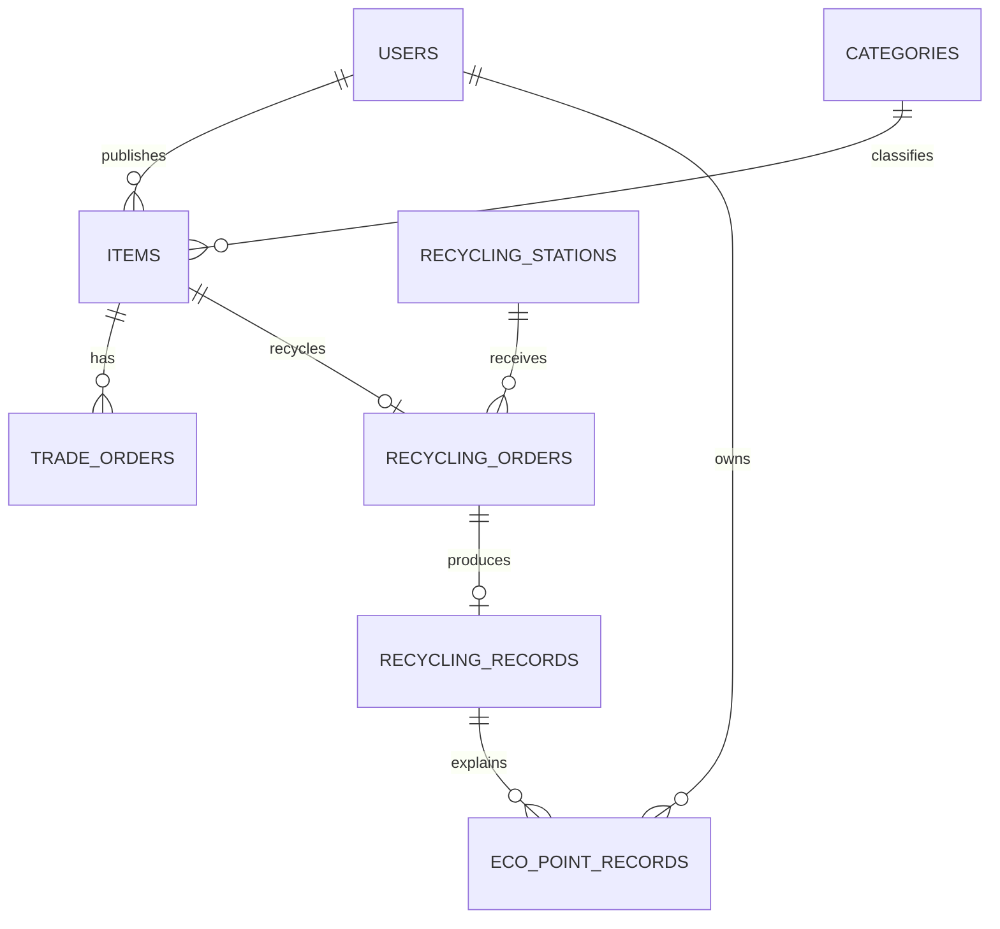

# E-R 图

```mermaid
erDiagram
 USERS ||--o{ ITEMS : publishes
 CATEGORIES ||--o{ ITEMS : classifies
 ITEMS ||--o{ TRADE_ORDERS : has
 ITEMS ||--o| RECYCLING_ORDERS : recycles
 RECYCLING_STATIONS ||--o{ RECYCLING_ORDERS : receives
 RECYCLING_ORDERS ||--o| RECYCLING_RECORDS : produces
 USERS ||--o{ ECO_POINT_RECORDS : owns
 RECYCLING_RECORDS ||--o{ ECO_POINT_RECORDS : explains
```
